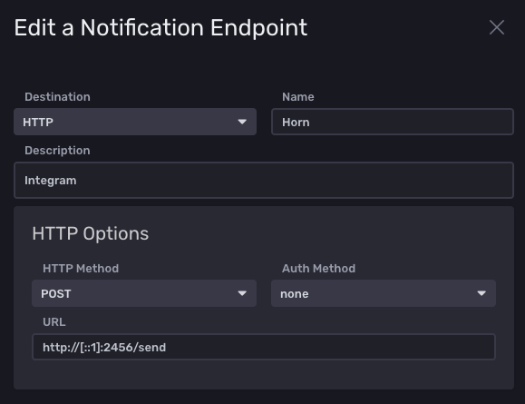

# influx-to-horn

An Influxdb notification endpoint proxy to send notifications to Integrams Horn Telegram Bot.

Influxdb does not natively support Integram Horn. The JSON in the HTTP POST request from Influxdb is not compatible with Integrams API. This application takes the POST request from Influxdb, extract the notification message and relays it to Integram for delivery into your chat with the Horn bot.

## Usage

1. Start a conversation with [Integrams Horn Telegram bot](https://t.me/bullhorn_bot)
2. Extract your acces token (Example: `https://integram.org/webhook/se6hieb4mu9L` -> `se6hieb4mu9L`)
3. Compile the binary (Example: `GOOS=linux GOARCH=amd64 go build -o influx-to-horn main.go`)
4. Run the binary by passing your token via env variable. For example: `HOOKID=se6hieb4mu9L ./influx-to-horn`. It will do a wildcard bind on port 2456.
5. Configure your server as POST target in the Influx UI. I'm running this application on the same server as influx so my target is `http://[::1]:2456/send`. Set "Auth Method" to "None".
6. Integrate it into your deployment strategy/create a systemd service/whatever



## Example systemd service file

My systemd service file under /etc/systemd/system/influx-to-horn main.service:

```
[Unit]
Description=Influx to horn
Wants=network-online.target
After=network.target network-online.target

[Service]
Environment="HOOKID=se6hieb4mu9L"
WorkingDirectory=/home/veloc1ty/
ExecStart=/home/veloc1ty/influx-to-horn
User=veloc1ty
Group=veloc1ty
Restart=on-failure

[Install]
WantedBy=multi-user.target
```

Don't forget to `systemctl daemon-reload`, `systemctl start influx-to-horn` and `systemctl enable influx-to-horn` afterwards.
